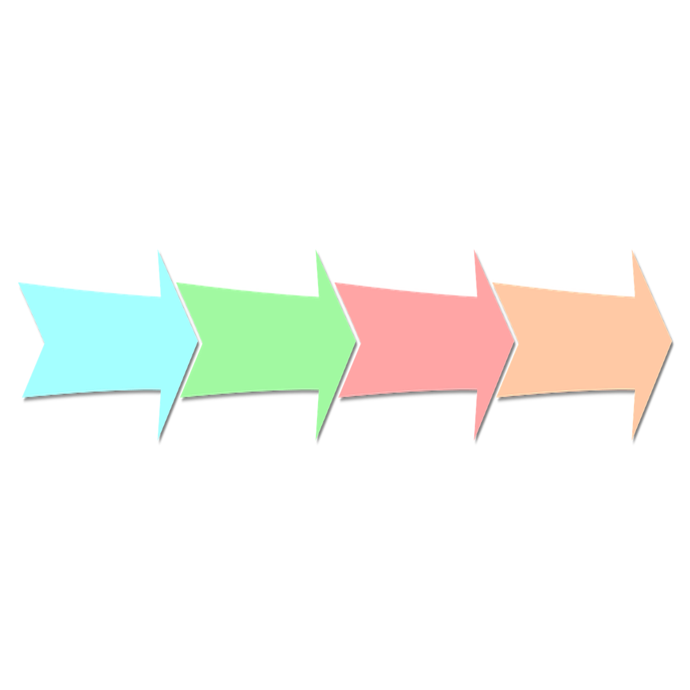

# 游戏阶段 Game Phase

| [![][curseforge-badge]][curseforge-download] | [![][modrinth-badge]][modrinth-download] | [![][discord-badge]][discord-link] |
| -------------------------------------------- | ---------------------------------------- | ---------------------------------- |

<h2 align="center">游戏阶段</h2>

Game Phase为MC引入了阶段系统。  
你可以使用[KubeJS](https://github.com/KubeJS-Mods/KubeJS)定义某些物品和维度属于某个阶段，当玩家获取这个阶段时才能访问它们。  
Game Phase的理念来源于[Game Stages](https://github.com/Darkhax-Minecraft/Game-Stages)及其附属。GP更加适应高版本，解决了GS及其附属中的一些bug。

使用教程：[Wiki](https://github.com/CPearl0/GamePhase/wiki)

### 相关链接：

> QQ群：`677453983`

---

<h2 align="center">Game Phase</h2>

Game Phase provides a phase system for MC.  
You can use [KubeJS](https://github.com/KubeJS-Mods/KubeJS) to define that some items and dimensions belong to certain phase. Only if players gain the phase will they have access to them.  
The idea of Game Phase come from [Game Stages](https://github.com/Darkhax-Minecraft/Game-Stages) and its addons. GP is more fit for higher versions of MC, as it solves some bugs in GS and its addons.  

Guide: [Wiki](https://github.com/CPearl0/GamePhase/wiki)  

### Links:

> QQ Group: `677453983`

---

[curseforge-badge]: https://img.shields.io/curseforge/dt/975444?style=for-the-badge&logo=curseforge&label=CurseForge%20Downloads&labelColor=0d0d0d&color=ff784d
[curseforge-download]: https://www.curseforge.com/minecraft/mc-mods/game-phase
[modrinth-badge]: https://img.shields.io/modrinth/dt/Rjr0gZy1?style=for-the-badge&logo=modrinth&labelColor=16181c&color=17b85a
[modrinth-download]: https://modrinth.com/mod/game-phase
[discord-badge]: https://img.shields.io/discord/1203359505841389670?style=for-the-badge&logo=discord&label=discord&labelColor=2b2d31&color=23a55a
[discord-link]: https://discord.gg/EbRDmZmGKz
